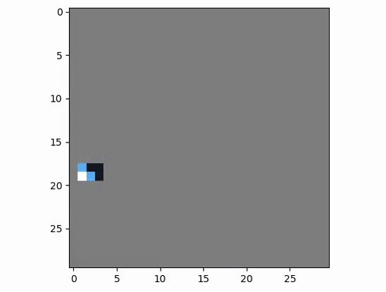
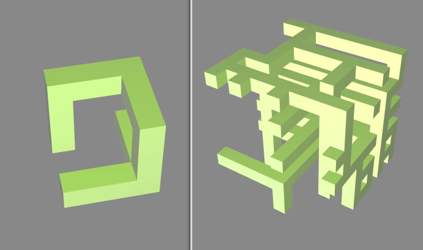

# wave-function-collapse

[Wave function collapse](https://github.com/mxgmn/WaveFunctionCollapse) python implementation.
It supports 1D, 2D, 3D samples.



## Installation
```
pip install -r requirements.txt
```
[py-vox-io](https://github.com/gromgull/py-vox-io) is used to load magica voxel file to numpy array.

## Usage
See `main.py` for usage example.

## Examples

### Midi file
See `examples/midi.py`

### Voxel
See `examples/voxel.py`


